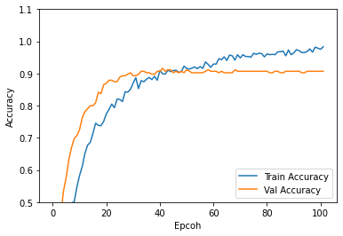
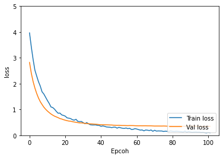

# Grocery-Classifier-

This project is built as part of Aarush Challange, a Machine Learning Challenge organised by SRM University.
 
The Image Classifier model developed is capable of classifying 19 categories of grocery items with **93% Accuracy** and makes use of ResNet50 and Efficientnet models pretrained layers available on tensorflow_hub.
 

# Sample:
 

